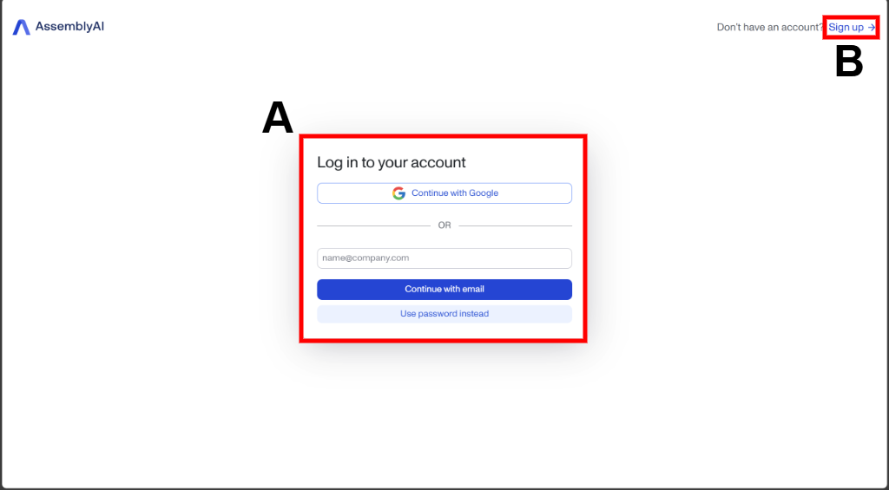
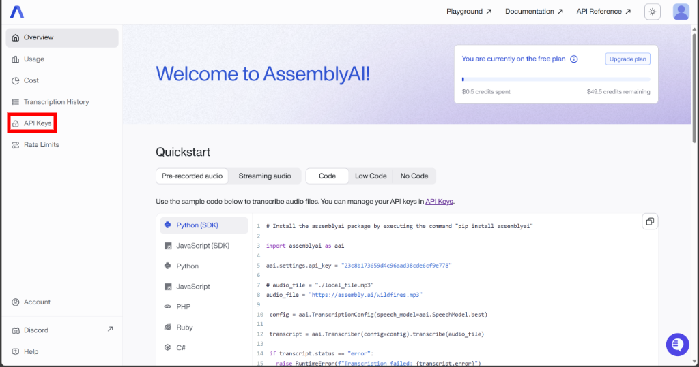
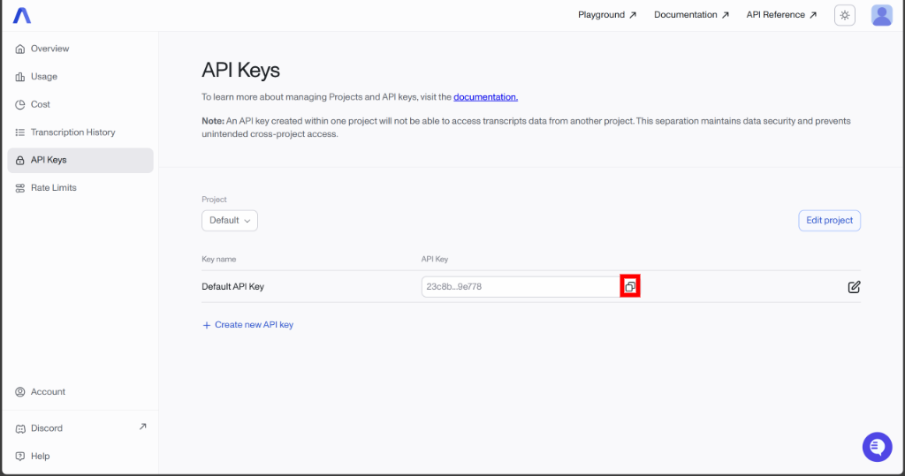

## 🔑 API Key Setup

1. Go to the [AssemblyAI authentication page](https://www.assemblyai.com/dashboard/login)
2. Log in (A) to your account or register (B)  
   

3. On the opened page in menu on the left side choose **API Keys**  
   

4. Copy the value  
   

## 🔧 Manually updating the API Key

**If you need to change your API key after installation, follow these steps:**

1. On the Windows taskbar, search for `Edit environment variables for your account`
2. In the opened window, click the **Environment Variables...** button at the bottom
3. In the "User variables for <user_name>" section, find the row named `ASSEMBLY_AI_API_KEY`, select it, click **`Edit...`** below the table and enter the new API key value

> ⚠️ Important: Do **not** change the **`variable name`**, otherwise the application will no longer be able to retrieve your API key.

## 💡 Tips

- 🔒 Never share your API key publicly — it’s tied to your personal account